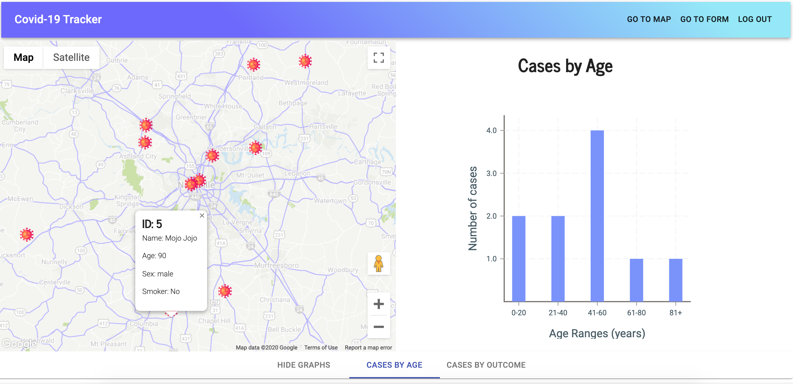

# Covid-19-Tracker
A website for users to self-report their COVID-19 test results which can then be tracked by epidemiologists to model the spread of the illness, and view data visualizations about patients' medical statuses. The on opening the page, the user is prompted to create and account. They then fill out a form with personal information and medical history, and are asked permission for the browser to use their location. On sumbitting the form, a map is displayed with their location and information displayed, and tabs to view aggregate data about users' demographic information, medical status and outcomes. 

## Motivation
Our motivation for this project was simple: as the COVID-19 pandemic unfolded, we knew we wanted to build something, even something simple, that would address the crisis through coding. 

## View
View the deployed application on [Heroku](https://shrouded-reaches-41007.herokuapp.com/)

## Instillation/ Set-up
1. Clone or Fork this repo on to your local machine
2. Open in your code editor
3. run `npm start`
4. run `npm run seed` to seed the database with fake users (optional)
5. Enjoy!

## Technologies Used
#### Front-End
* React.js
* Material-UI
* Victory Charts
* React-Google-Maps
* Geolocation API

#### Back-End
* Node.js
* MySQL
* Sequelize ORM
* Passport.js

## Plans for Future Development
As it's generally inadvisable to display medical histories to the general public, we intend to update the app to allow for two modes of user authentication: admin and general. As an admin, the user would recieve a special password that would grant them permission to view personal information about the user population. As a general user, one would only be able to view locations and aggregate data, and would not have access to personal details. 

## Authors: github/email
* Kogan Pack: koganp42 / koganp42@gmail.com
* Jamie Kook: JamieKook / kookjc6@gmail.com
* Alex Dollard: acdollard / alexdollard141@gmail.com
